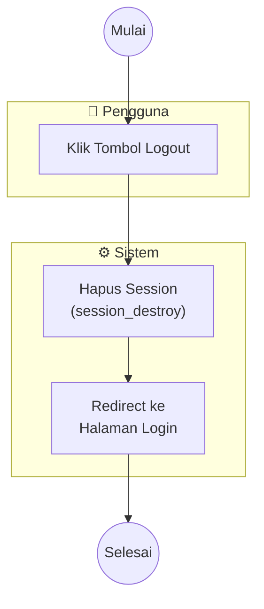

# Activity Diagram — UC2: Logout

## Aktor: Semua (Customer, Admin, Mekanik)

```mermaid
flowchart TD
    Mulai(("Mulai"))

    subgraph Pengguna["👤 Pengguna"]
        O1["Klik Tombol Logout"]
    end

    subgraph Sistem["⚙️ Sistem"]
        O2["Hapus Session\n(session_destroy)"]
        O3["Redirect ke\nHalaman Login"]
    end

    Selesai(("Selesai"))

    Mulai --> O1
    O1 --> O2
    O2 --> O3
    O3 --> Selesai
```
