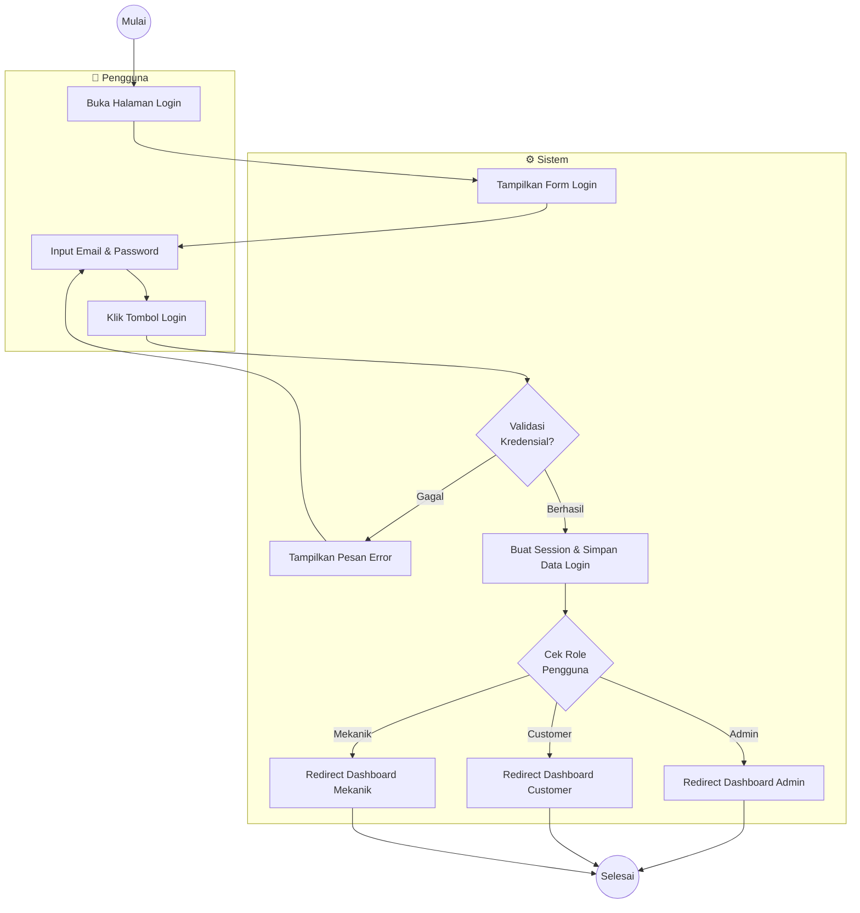

# Activity Diagram — UC1: Login

## Aktor: Semua (Customer, Admin, Mekanik)

```mermaid
flowchart TD
    Mulai(("Mulai"))

    subgraph Pengguna["👤 Pengguna"]
        L1["Buka Halaman Login"]
        L3["Input Email & Password"]
        L4["Klik Tombol Login"]
    end

    subgraph Sistem["⚙️ Sistem"]
        L2["Tampilkan Form Login"]
        L5{"Validasi\nKredensial?"}
        L6["Tampilkan Pesan Error"]
        L7{"Cek Role\nPengguna"}
        L8["Redirect Dashboard Admin"]
        L9["Redirect Dashboard Customer"]
        L10["Redirect Dashboard Mekanik"]
        L11["Buat Session & Simpan Data Login"]
    end

    Selesai(("Selesai"))

    Mulai --> L1
    L1 --> L2
    L2 --> L3
    L3 --> L4
    L4 --> L5
    L5 -->|"Gagal"| L6
    L6 --> L3
    L5 -->|"Berhasil"| L11
    L11 --> L7
    L7 -->|"Admin"| L8
    L7 -->|"Customer"| L9
    L7 -->|"Mekanik"| L10
    L8 --> Selesai
    L9 --> Selesai
    L10 --> Selesai
```
