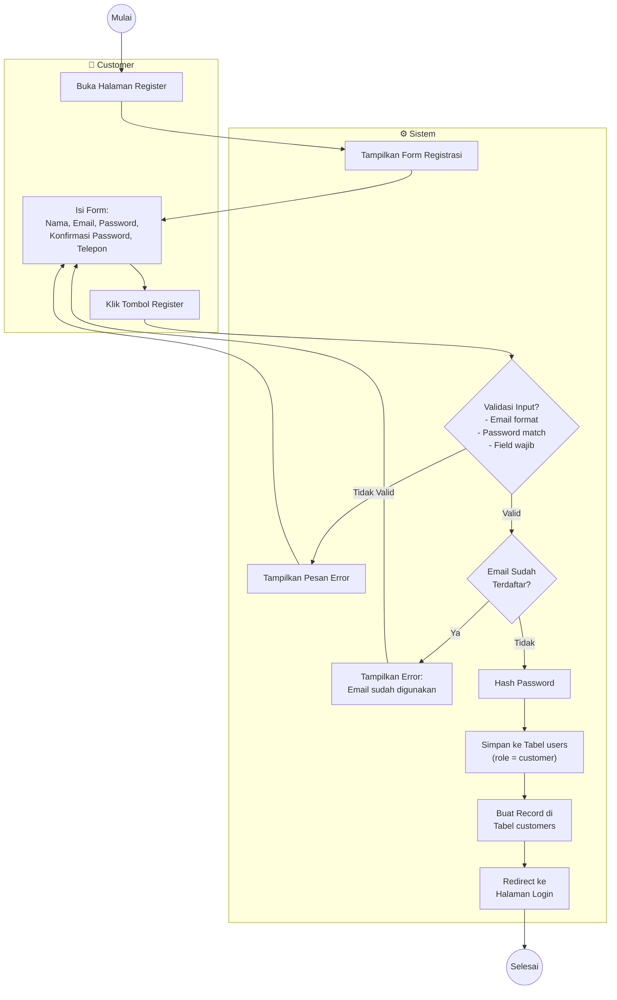

# Activity Diagram — UC3: Registrasi Akun

## Aktor: Customer (calon)

```mermaid
flowchart TD
    Mulai(("Mulai"))

    subgraph Customer["👤 Customer"]
        R1["Buka Halaman Register"]
        R3["Isi Form:\nNama, Email, Password,\nKonfirmasi Password, Telepon"]
        R5["Klik Tombol Register"]
    end

    subgraph Sistem["⚙️ Sistem"]
        R2["Tampilkan Form Registrasi"]
        R6{"Validasi Input?\n- Email format\n- Password match\n- Field wajib"}
        R7["Tampilkan Pesan Error"]
        R8{"Email Sudah\nTerdaftar?"}
        R9["Tampilkan Error:\nEmail sudah digunakan"]
        R10["Hash Password"]
        R11["Simpan ke Tabel users\n(role = customer)"]
        R12["Buat Record di\nTabel customers"]
        R13["Redirect ke\nHalaman Login"]
    end

    Selesai(("Selesai"))

    Mulai --> R1
    R1 --> R2
    R2 --> R3
    R3 --> R5
    R5 --> R6
    R6 -->|"Tidak Valid"| R7
    R7 --> R3
    R6 -->|"Valid"| R8
    R8 -->|"Ya"| R9
    R9 --> R3
    R8 -->|"Tidak"| R10
    R10 --> R11
    R11 --> R12
    R12 --> R13
    R13 --> Selesai
```
