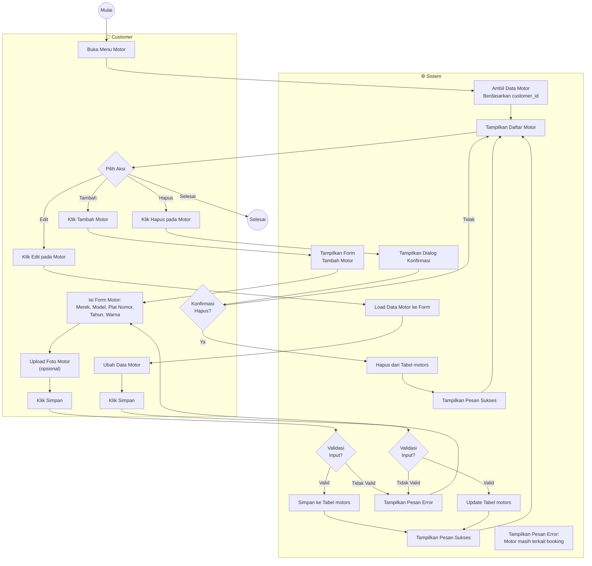

# Activity Diagram — UC4: Kelola Motor (CRUD)

## Aktor: Customer

```mermaid
flowchart TD
    Mulai(("Mulai"))

    subgraph Customer["👤 Customer"]
        M1["Buka Menu Motor"]
        M4{"Pilih Aksi"}
        M5["Klik Tambah Motor"]
        M8["Isi Form Motor:\nMerek, Model, Plat Nomor,\nTahun, Warna"]
        M9["Upload Foto Motor\n(opsional)"]
        M10["Klik Simpan"]
        M14["Klik Edit pada Motor"]
        M16["Ubah Data Motor"]
        M17["Klik Simpan"]
        M20["Klik Hapus pada Motor"]
        M22{"Konfirmasi\nHapus?"}
    end

    subgraph Sistem["⚙️ Sistem"]
        M2["Ambil Data Motor\nBerdasarkan customer_id"]
        M3["Tampilkan Daftar Motor"]
        M6["Tampilkan Form\nTambah Motor"]
        M11{"Validasi\nInput?"}
        M12["Simpan ke Tabel motors"]
        M13["Tampilkan Pesan Sukses"]
        M7["Tampilkan Pesan Error"]
        M15["Load Data Motor ke Form"]
        M18{"Validasi\nInput?"}
        M19["Update Tabel motors"]
        M21["Tampilkan Dialog Konfirmasi"]
        M23["Hapus dari Tabel motors"]
        M24["Tampilkan Pesan Sukses"]
        M25["Tampilkan Pesan Error:\nMotor masih terkait booking"]
    end

    Selesai(("Selesai"))

    Mulai --> M1
    M1 --> M2
    M2 --> M3
    M3 --> M4
    M4 -->|"Tambah"| M5
    M4 -->|"Edit"| M14
    M4 -->|"Hapus"| M20
    M4 -->|"Selesai"| Selesai

    M5 --> M6
    M6 --> M8
    M8 --> M9
    M9 --> M10
    M10 --> M11
    M11 -->|"Tidak Valid"| M7
    M7 --> M8
    M11 -->|"Valid"| M12
    M12 --> M13
    M13 --> M3

    M14 --> M15
    M15 --> M16
    M16 --> M17
    M17 --> M18
    M18 -->|"Tidak Valid"| M7
    M18 -->|"Valid"| M19
    M19 --> M13

    M20 --> M21
    M21 --> M22
    M22 -->|"Tidak"| M3
    M22 -->|"Ya"| M23
    M23 --> M24
    M24 --> M3
```
