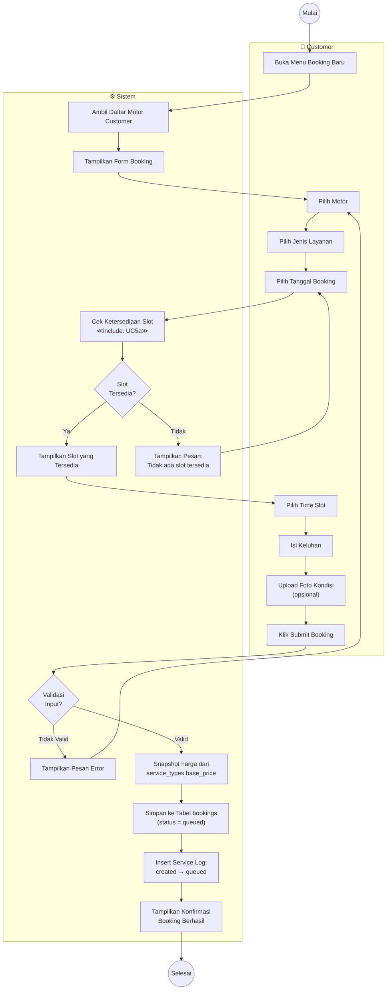

# Activity Diagram — UC5: Booking Servis

## Aktor: Customer
## Include: UC5a — Cek Ketersediaan Slot

```mermaid
flowchart TD
    Mulai(("Mulai"))

    subgraph Customer["👤 Customer"]
        B1["Buka Menu Booking Baru"]
        B4["Pilih Motor"]
        B5["Pilih Jenis Layanan"]
        B6["Pilih Tanggal Booking"]
        B10["Pilih Time Slot"]
        B11["Isi Keluhan"]
        B12["Upload Foto Kondisi\n(opsional)"]
        B13["Klik Submit Booking"]
    end

    subgraph Sistem["⚙️ Sistem"]
        B2["Ambil Daftar Motor Customer"]
        B3["Tampilkan Form Booking"]
        B7["Cek Ketersediaan Slot\n≪include: UC5a≫"]
        B8{"Slot\nTersedia?"}
        B9["Tampilkan Slot yang Tersedia"]
        B8a["Tampilkan Pesan:\nTidak ada slot tersedia"]
        B14{"Validasi\nInput?"}
        B15["Tampilkan Pesan Error"]
        B16["Snapshot harga dari\nservice_types.base_price"]
        B17["Simpan ke Tabel bookings\n(status = queued)"]
        B18["Insert Service Log:\ncreated → queued"]
        B19["Tampilkan Konfirmasi\nBooking Berhasil"]
    end

    Selesai(("Selesai"))

    Mulai --> B1
    B1 --> B2
    B2 --> B3
    B3 --> B4
    B4 --> B5
    B5 --> B6
    B6 --> B7
    B7 --> B8
    B8 -->|"Tidak"| B8a
    B8a --> B6
    B8 -->|"Ya"| B9
    B9 --> B10
    B10 --> B11
    B11 --> B12
    B12 --> B13
    B13 --> B14
    B14 -->|"Tidak Valid"| B15
    B15 --> B4
    B14 -->|"Valid"| B16
    B16 --> B17
    B17 --> B18
    B18 --> B19
    B19 --> Selesai
```
