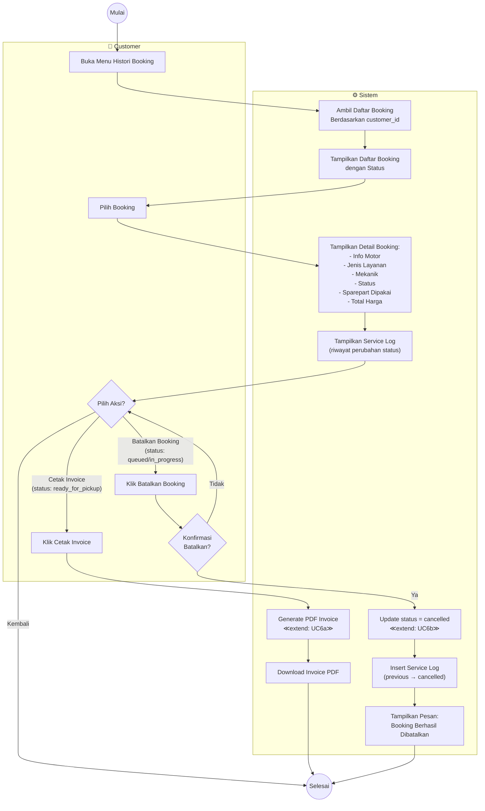

# Activity Diagram — UC6: Lacak Status Servis

## Aktor: Customer
## Extend: UC6a — Cetak Invoice, UC6b — Batalkan Booking

```mermaid
flowchart TD
    Mulai(("Mulai"))

    subgraph Customer["👤 Customer"]
        T1["Buka Menu Histori Booking"]
        T4["Pilih Booking"]
        T7{"Pilih Aksi?"}
        T8["Klik Cetak Invoice"]
        T11["Klik Batalkan Booking"]
        T12{"Konfirmasi\nBatalkan?"}
    end

    subgraph Sistem["⚙️ Sistem"]
        T2["Ambil Daftar Booking\nBerdasarkan customer_id"]
        T3["Tampilkan Daftar Booking\ndengan Status"]
        T5["Tampilkan Detail Booking:\n- Info Motor\n- Jenis Layanan\n- Mekanik\n- Status\n- Sparepart Dipakai\n- Total Harga"]
        T6["Tampilkan Service Log\n(riwayat perubahan status)"]
        T9["Generate PDF Invoice\n≪extend: UC6a≫"]
        T10["Download Invoice PDF"]
        T13["Update status = cancelled\n≪extend: UC6b≫"]
        T14["Insert Service Log\n(previous → cancelled)"]
        T15["Tampilkan Pesan:\nBooking Berhasil Dibatalkan"]
    end

    Selesai(("Selesai"))

    Mulai --> T1
    T1 --> T2
    T2 --> T3
    T3 --> T4
    T4 --> T5
    T5 --> T6
    T6 --> T7
    T7 -->|"Cetak Invoice\n(status: ready_for_pickup)"| T8
    T7 -->|"Batalkan Booking\n(status: queued/in_progress)"| T11
    T7 -->|"Kembali"| Selesai
    T8 --> T9
    T9 --> T10
    T10 --> Selesai
    T11 --> T12
    T12 -->|"Tidak"| T7
    T12 -->|"Ya"| T13
    T13 --> T14
    T14 --> T15
    T15 --> Selesai
```
