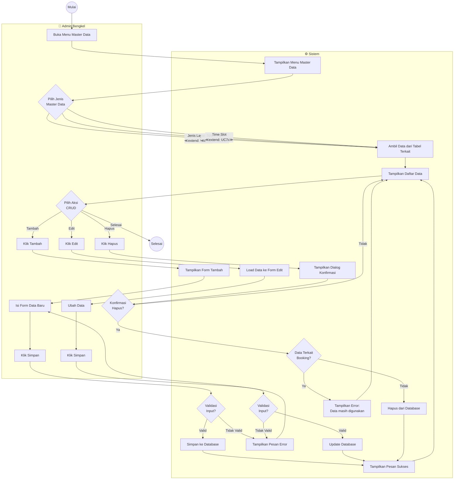

# Activity Diagram — UC7: Kelola Data Master

## Aktor: Admin
## Extend: UC7a (Jenis Layanan), UC7b (Spare Part), UC7c (Time Slot)

```mermaid
flowchart TD
    Mulai(("Mulai"))

    subgraph Admin["👤 Admin Bengkel"]
        D1["Buka Menu Master Data"]
        D3{"Pilih Jenis\nMaster Data"}
        D6{"Pilih Aksi\nCRUD"}
        D9["Klik Tambah"]
        D12["Isi Form Data Baru"]
        D13["Klik Simpan"]
        D17["Klik Edit"]
        D19["Ubah Data"]
        D20["Klik Simpan"]
        D23["Klik Hapus"]
        D25{"Konfirmasi\nHapus?"}
    end

    subgraph Sistem["⚙️ Sistem"]
        D2["Tampilkan Menu Master Data"]
        D4["Ambil Data dari Tabel Terkait"]
        D5["Tampilkan Daftar Data"]
        D10["Tampilkan Form Tambah"]
        D14{"Validasi\nInput?"}
        D15["Simpan ke Database"]
        D16["Tampilkan Pesan Sukses"]
        D11["Tampilkan Pesan Error"]
        D18["Load Data ke Form Edit"]
        D21{"Validasi\nInput?"}
        D22["Update Database"]
        D24["Tampilkan Dialog Konfirmasi"]
        D26{"Data Terkait\nBooking?"}
        D27["Hapus dari Database"]
        D28["Tampilkan Error:\nData masih digunakan"]
    end

    Selesai(("Selesai"))

    Mulai --> D1
    D1 --> D2
    D2 --> D3
    D3 -->|"Jenis Layanan\n≪extend: UC7a≫"| D4
    D3 -->|"Spare Part\n≪extend: UC7b≫"| D4
    D3 -->|"Time Slot\n≪extend: UC7c≫"| D4
    D4 --> D5
    D5 --> D6
    D6 -->|"Tambah"| D9
    D6 -->|"Edit"| D17
    D6 -->|"Hapus"| D23
    D6 -->|"Selesai"| Selesai

    D9 --> D10
    D10 --> D12
    D12 --> D13
    D13 --> D14
    D14 -->|"Tidak Valid"| D11
    D11 --> D12
    D14 -->|"Valid"| D15
    D15 --> D16
    D16 --> D5

    D17 --> D18
    D18 --> D19
    D19 --> D20
    D20 --> D21
    D21 -->|"Tidak Valid"| D11
    D21 -->|"Valid"| D22
    D22 --> D16

    D23 --> D24
    D24 --> D25
    D25 -->|"Tidak"| D5
    D25 -->|"Ya"| D26
    D26 -->|"Ya"| D28
    D28 --> D5
    D26 -->|"Tidak"| D27
    D27 --> D16
```
