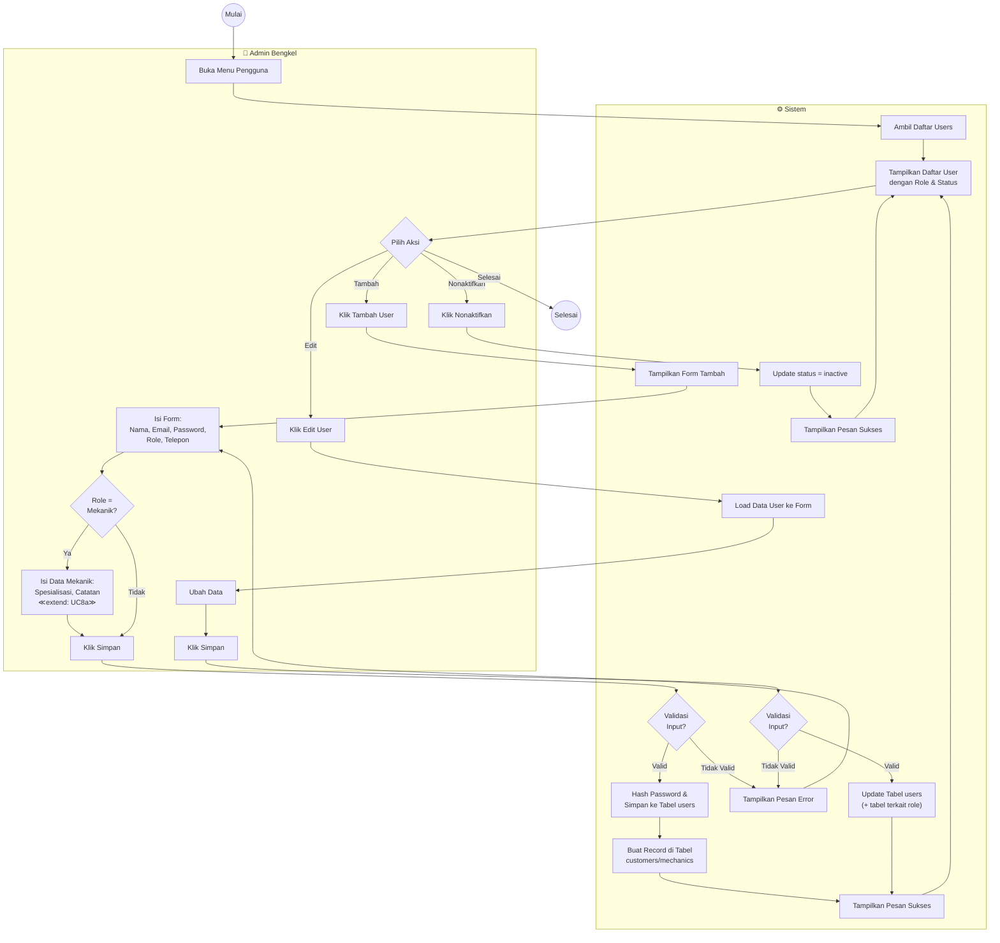

# Activity Diagram — UC8: Kelola Pengguna

## Aktor: Admin
## Extend: UC8a — Kelola Mekanik

```mermaid
flowchart TD
    Mulai(("Mulai"))

    subgraph Admin["👤 Admin Bengkel"]
        U1["Buka Menu Pengguna"]
        U4{"Pilih Aksi"}
        U5["Klik Tambah User"]
        U8["Isi Form:\nNama, Email, Password,\nRole, Telepon"]
        U9{"Role =\nMekanik?"}
        U10["Isi Data Mekanik:\nSpesialisasi, Catatan\n≪extend: UC8a≫"]
        U11["Klik Simpan"]
        U15["Klik Edit User"]
        U17["Ubah Data"]
        U18["Klik Simpan"]
        U21["Klik Nonaktifkan"]
    end

    subgraph Sistem["⚙️ Sistem"]
        U2["Ambil Daftar Users"]
        U3["Tampilkan Daftar User\ndengan Role & Status"]
        U6["Tampilkan Form Tambah"]
        U12{"Validasi\nInput?"}
        U13["Hash Password &\nSimpan ke Tabel users"]
        U13a["Buat Record di Tabel\ncustomers/mechanics"]
        U14["Tampilkan Pesan Sukses"]
        U7["Tampilkan Pesan Error"]
        U16["Load Data User ke Form"]
        U19{"Validasi\nInput?"}
        U20["Update Tabel users\n(+ tabel terkait role)"]
        U22["Update status = inactive"]
        U23["Tampilkan Pesan Sukses"]
    end

    Selesai(("Selesai"))

    Mulai --> U1
    U1 --> U2
    U2 --> U3
    U3 --> U4
    U4 -->|"Tambah"| U5
    U4 -->|"Edit"| U15
    U4 -->|"Nonaktifkan"| U21
    U4 -->|"Selesai"| Selesai

    U5 --> U6
    U6 --> U8
    U8 --> U9
    U9 -->|"Ya"| U10
    U10 --> U11
    U9 -->|"Tidak"| U11
    U11 --> U12
    U12 -->|"Tidak Valid"| U7
    U7 --> U8
    U12 -->|"Valid"| U13
    U13 --> U13a
    U13a --> U14
    U14 --> U3

    U15 --> U16
    U16 --> U17
    U17 --> U18
    U18 --> U19
    U19 -->|"Tidak Valid"| U7
    U19 -->|"Valid"| U20
    U20 --> U14

    U21 --> U22
    U22 --> U23
    U23 --> U3
```
