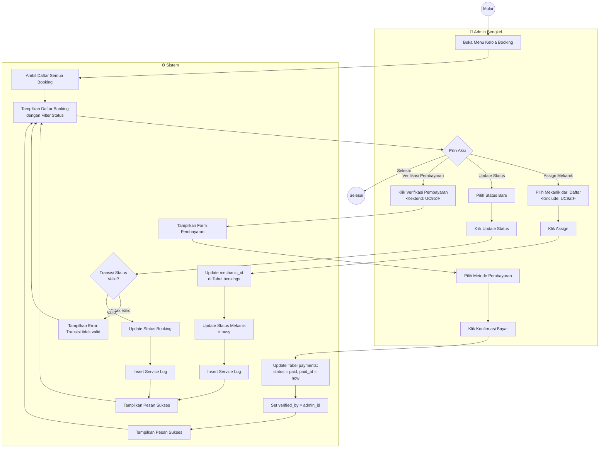
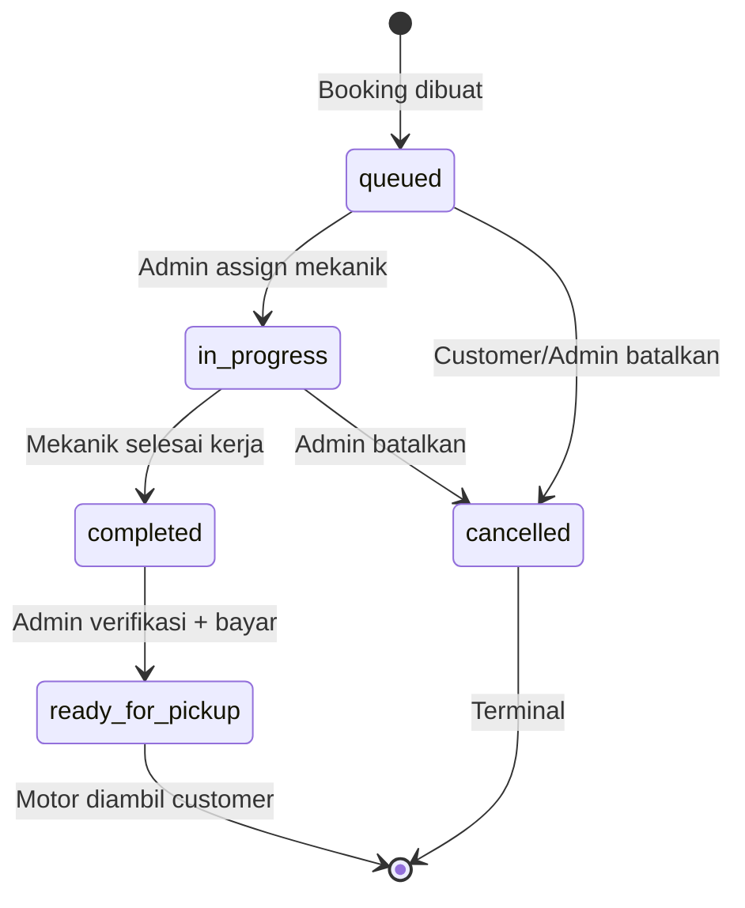

# Activity Diagram — UC9: Kelola Booking & Servis

## Aktor: Admin
## Include: UC9a — Assign Mekanik
## Extend: UC9b — Verifikasi & Pembayaran

```mermaid
flowchart TD
    Mulai(("Mulai"))

    subgraph Admin["👤 Admin Bengkel"]
        K1["Buka Menu Kelola Booking"]
        K4{"Pilih Aksi"}
        K5["Pilih Mekanik dari Daftar\n≪include: UC9a≫"]
        K6["Klik Assign"]
        K10["Pilih Status Baru"]
        K11["Klik Update Status"]
        K16["Klik Verifikasi Pembayaran\n≪extend: UC9b≫"]
        K18["Pilih Metode Pembayaran"]
        K19["Klik Konfirmasi Bayar"]
    end

    subgraph Sistem["⚙️ Sistem"]
        K2["Ambil Daftar Semua Booking"]
        K3["Tampilkan Daftar Booking\ndengan Filter Status"]
        K7["Update mechanic_id\ndi Tabel bookings"]
        K8["Update Status Mekanik\n= busy"]
        K9["Insert Service Log"]
        K12{"Transisi Status\nValid?"}
        K13["Update Status Booking"]
        K14["Insert Service Log"]
        K15["Tampilkan Pesan Sukses"]
        K12a["Tampilkan Error:\nTransisi tidak valid"]
        K17["Tampilkan Form Pembayaran"]
        K20["Update Tabel payments:\nstatus = paid, paid_at = now"]
        K21["Set verified_by = admin_id"]
        K22["Tampilkan Pesan Sukses"]
    end

    Selesai(("Selesai"))

    Mulai --> K1
    K1 --> K2
    K2 --> K3
    K3 --> K4

    K4 -->|"Assign Mekanik"| K5
    K4 -->|"Update Status"| K10
    K4 -->|"Verifikasi Pembayaran"| K16
    K4 -->|"Selesai"| Selesai

    K5 --> K6
    K6 --> K7
    K7 --> K8
    K8 --> K9
    K9 --> K15
    K15 --> K3

    K10 --> K11
    K11 --> K12
    K12 -->|"Tidak Valid"| K12a
    K12a --> K3
    K12 -->|"Valid"| K13
    K13 --> K14
    K14 --> K15

    K16 --> K17
    K17 --> K18
    K18 --> K19
    K19 --> K20
    K20 --> K21
    K21 --> K22
    K22 --> K3
```

## State Machine — Transisi Status Booking

```mermaid
stateDiagram-v2
    [*] --> queued : Booking dibuat
    queued --> in_progress : Admin assign mekanik
    queued --> cancelled : Customer/Admin batalkan
    in_progress --> completed : Mekanik selesai kerja
    in_progress --> cancelled : Admin batalkan
    completed --> ready_for_pickup : Admin verifikasi + bayar
    ready_for_pickup --> [*] : Motor diambil customer
    cancelled --> [*] : Terminal
```
