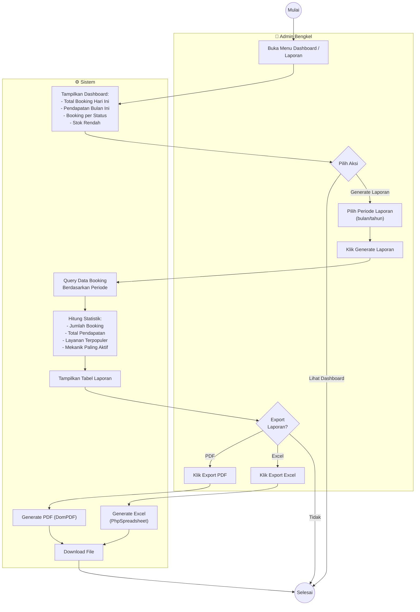

# Activity Diagram — UC10: Lihat Laporan & Dashboard

## Aktor: Admin

```mermaid
flowchart TD
    Mulai(("Mulai"))

    subgraph Admin["👤 Admin Bengkel"]
        P1["Buka Menu Dashboard /\nLaporan"]
        P3{"Pilih Aksi"}
        P4["Pilih Periode Laporan\n(bulan/tahun)"]
        P5["Klik Generate Laporan"]
        P9{"Export\nLaporan?"}
        P10["Klik Export PDF"]
        P11["Klik Export Excel"]
    end

    subgraph Sistem["⚙️ Sistem"]
        P2["Tampilkan Dashboard:\n- Total Booking Hari Ini\n- Pendapatan Bulan Ini\n- Booking per Status\n- Stok Rendah"]
        P6["Query Data Booking\nBerdasarkan Periode"]
        P7["Hitung Statistik:\n- Jumlah Booking\n- Total Pendapatan\n- Layanan Terpopuler\n- Mekanik Paling Aktif"]
        P8["Tampilkan Tabel Laporan"]
        P12["Generate PDF (DomPDF)"]
        P13["Generate Excel\n(PhpSpreadsheet)"]
        P14["Download File"]
    end

    Selesai(("Selesai"))

    Mulai --> P1
    P1 --> P2
    P2 --> P3
    P3 -->|"Lihat Dashboard"| Selesai
    P3 -->|"Generate Laporan"| P4
    P4 --> P5
    P5 --> P6
    P6 --> P7
    P7 --> P8
    P8 --> P9
    P9 -->|"PDF"| P10
    P10 --> P12
    P12 --> P14
    P14 --> Selesai
    P9 -->|"Excel"| P11
    P11 --> P13
    P13 --> P14
    P9 -->|"Tidak"| Selesai
```
