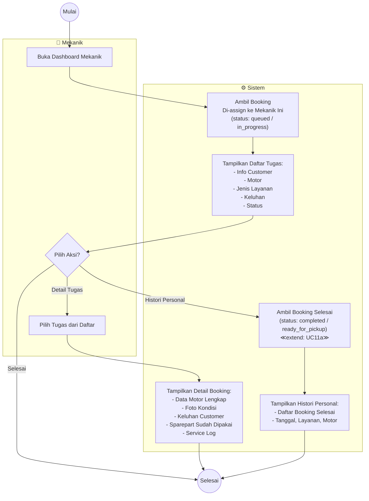

# Activity Diagram — UC11: Lihat Tugas

## Aktor: Mekanik
## Extend: UC11a — Lihat Histori Personal

```mermaid
flowchart TD
    Mulai(("Mulai"))

    subgraph Mekanik["🔧 Mekanik"]
        G1["Buka Dashboard Mekanik"]
        G5{"Pilih Aksi?"}
        G6["Pilih Tugas dari Daftar"]
    end

    subgraph Sistem["⚙️ Sistem"]
        G2["Ambil Booking\nDi-assign ke Mekanik Ini\n(status: queued / in_progress)"]
        G3["Tampilkan Daftar Tugas:\n- Info Customer\n- Motor\n- Jenis Layanan\n- Keluhan\n- Status"]
        G7["Tampilkan Detail Booking:\n- Data Motor Lengkap\n- Foto Kondisi\n- Keluhan Customer\n- Sparepart Sudah Dipakai\n- Service Log"]
        G4["Ambil Booking Selesai\n(status: completed / ready_for_pickup)\n≪extend: UC11a≫"]
        G8["Tampilkan Histori Personal:\n- Daftar Booking Selesai\n- Tanggal, Layanan, Motor"]
    end

    Selesai(("Selesai"))

    Mulai --> G1
    G1 --> G2
    G2 --> G3
    G3 --> G5
    G5 -->|"Detail Tugas"| G6
    G5 -->|"Histori Personal"| G4
    G5 -->|"Selesai"| Selesai
    G6 --> G7
    G7 --> Selesai
    G4 --> G8
    G8 --> Selesai
```
