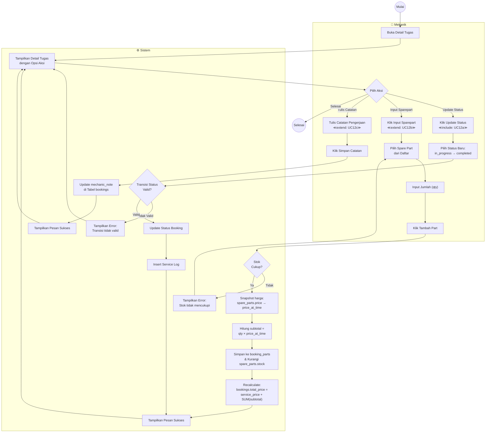

# Activity Diagram — UC12: Proses Pengerjaan

## Aktor: Mekanik
## Include: UC12a — Update Status
## Extend: UC12b — Input Sparepart, UC12c — Tulis Catatan

```mermaid
flowchart TD
    Mulai(("Mulai"))

    subgraph Mekanik["🔧 Mekanik"]
        S1["Buka Detail Tugas"]
        S3{"Pilih Aksi"}
        S4["Klik Update Status\n≪include: UC12a≫"]
        S5["Pilih Status Baru:\nin_progress → completed"]
        S10["Klik Input Sparepart\n≪extend: UC12b≫"]
        S11["Pilih Spare Part\ndari Daftar"]
        S12["Input Jumlah (qty)"]
        S13["Klik Tambah Part"]
        S19["Tulis Catatan Pengerjaan\n≪extend: UC12c≫"]
        S20["Klik Simpan Catatan"]
    end

    subgraph Sistem["⚙️ Sistem"]
        S2["Tampilkan Detail Tugas\ndengan Opsi Aksi"]
        S6{"Transisi Status\nValid?"}
        S7["Update Status Booking"]
        S8["Insert Service Log"]
        S9["Tampilkan Pesan Sukses"]
        S6a["Tampilkan Error:\nTransisi tidak valid"]
        S14{"Stok\nCukup?"}
        S15["Snapshot harga:\nspare_parts.price → price_at_time"]
        S16["Hitung subtotal =\nqty × price_at_time"]
        S17["Simpan ke booking_parts\n& Kurangi spare_parts.stock"]
        S18["Recalculate:\nbookings.total_price =\nservice_price + SUM(subtotal)"]
        S14a["Tampilkan Error:\nStok tidak mencukupi"]
        S21["Update mechanic_note\ndi Tabel bookings"]
        S22["Tampilkan Pesan Sukses"]
    end

    Selesai(("Selesai"))

    Mulai --> S1
    S1 --> S2
    S2 --> S3

    S3 -->|"Update Status"| S4
    S3 -->|"Input Sparepart"| S10
    S3 -->|"Tulis Catatan"| S19
    S3 -->|"Selesai"| Selesai

    S4 --> S5
    S5 --> S6
    S6 -->|"Tidak Valid"| S6a
    S6a --> S2
    S6 -->|"Valid"| S7
    S7 --> S8
    S8 --> S9
    S9 --> S2

    S10 --> S11
    S11 --> S12
    S12 --> S13
    S13 --> S14
    S14 -->|"Tidak"| S14a
    S14a --> S11
    S14 -->|"Ya"| S15
    S15 --> S16
    S16 --> S17
    S17 --> S18
    S18 --> S9

    S19 --> S20
    S20 --> S21
    S21 --> S22
    S22 --> S2
```
