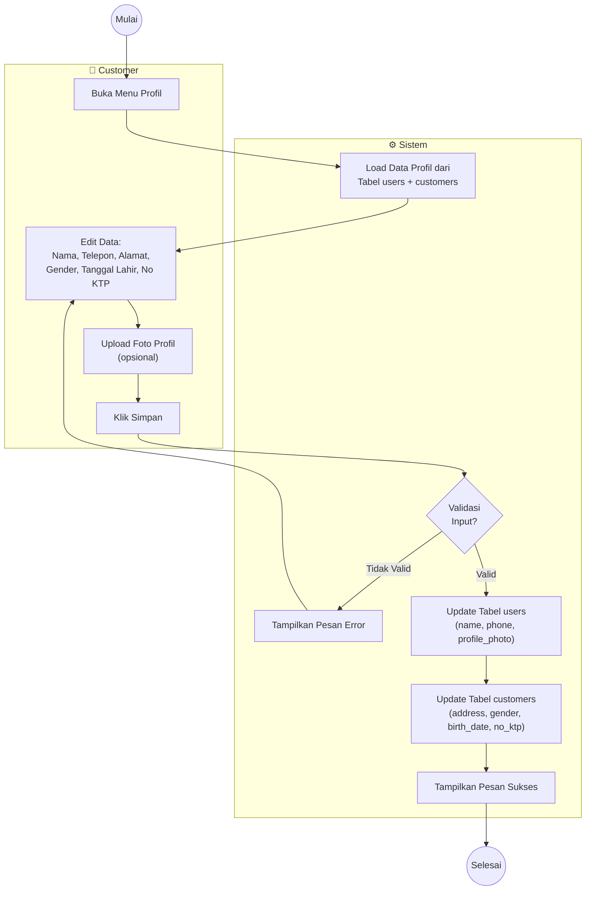

# Activity Diagram — UC13: Edit Profil

## Aktor: Customer

```mermaid
flowchart TD
    Mulai(("Mulai"))

    subgraph Customer["👤 Customer"]
        P1["Buka Menu Profil"]
        P3["Edit Data:\nNama, Telepon, Alamat,\nGender, Tanggal Lahir, No KTP"]
        P4["Upload Foto Profil\n(opsional)"]
        P5["Klik Simpan"]
    end

    subgraph Sistem["⚙️ Sistem"]
        P2["Load Data Profil dari\nTabel users + customers"]
        P6{"Validasi\nInput?"}
        P7["Tampilkan Pesan Error"]
        P8["Update Tabel users\n(name, phone, profile_photo)"]
        P9["Update Tabel customers\n(address, gender, birth_date, no_ktp)"]
        P10["Tampilkan Pesan Sukses"]
    end

    Selesai(("Selesai"))

    Mulai --> P1
    P1 --> P2
    P2 --> P3
    P3 --> P4
    P4 --> P5
    P5 --> P6
    P6 -->|"Tidak Valid"| P7
    P7 --> P3
    P6 -->|"Valid"| P8
    P8 --> P9
    P9 --> P10
    P10 --> Selesai
```
