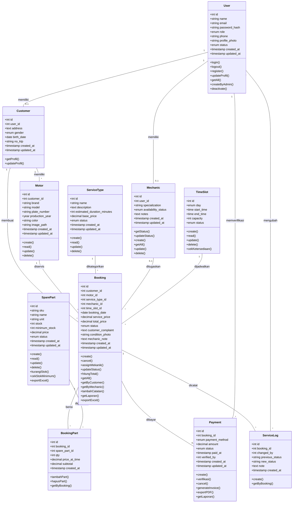

# Class Diagram — Sistem REVVO

## Diagram

## Catatan

- Karena proyek ini menggunakan **PHP Native prosedural** (tanpa OOP), class diagram ini merepresentasikan **model data/entitas domain**
- Method merepresentasikan operasi/fungsi yang tersedia pada entitas tersebut
- 11 class sesuai dengan 11 tabel di database
- Relasi `User → Customer` dan `User → Mechanic` adalah **1:0..1** (tidak semua user adalah customer/mekanik)

## Method yang Ditambahkan (Update)

| Class | Method Baru | Alasan |
|---|---|---|
| `User` | `getAll()`, `createByAdmin()`, `deactivate()` | Modul admin CRUD Users (Geral) |
| `Mechanic` | `create()`, `getAll()`, `update()`, `delete()` | Modul admin CRUD Mechanics (Raika) |
| `Booking` | `getAll()`, `getByCustomer()`, `getByMechanic()`, `tambahCatatan()`, `getLaporan()`, `exportExcel()` | Multi-role views + laporan (Dermawan) |
| `BookingPart` | `getByBooking()` | Dibutuhkan invoice & detail view |
| `SparePart` | `cekStokMinimum()`, `exportExcel()` | Dashboard alert + export (Dermawan) |
| `TimeSlot` | `delete()` | Fix inkonsistensi MD vs XML sebelumnya |
| `Payment` | `generateInvoice()`, `exportPDF()`, `getLaporan()` | Modul invoice (Nugi) + laporan keuangan |
