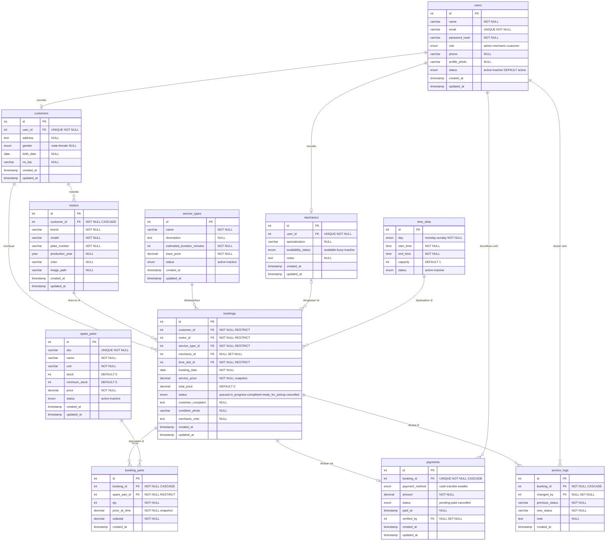

# Entity Relationship Diagram — Sistem REVVO

## Diagram (Mermaid ERD)

## Ringkasan: 11 Tabel, 14 Relasi

| Relasi | Kardinalitas | ON DELETE |
|--------|-------------|----------|
| users → customers | 1 : 0..1 | CASCADE |
| users → mechanics | 1 : 0..1 | CASCADE |
| customers → motors | 1 : N | CASCADE |
| customers → bookings | 1 : N | RESTRICT |
| motors → bookings | 1 : N | RESTRICT |
| service_types → bookings | 1 : N | RESTRICT |
| mechanics → bookings | 0..1 : N | SET NULL |
| time_slots → bookings | 1 : N | RESTRICT |
| bookings → booking_parts | 1 : N | CASCADE |
| spare_parts → booking_parts | 1 : N | RESTRICT |
| bookings → payments | 1 : 0..1 | CASCADE |
| bookings → service_logs | 1 : N | CASCADE |
| users → service_logs | 1 : N | SET NULL |
| users → payments | 1 : N | SET NULL |

## Koreksi dari ERD Lama (docs/diagrams/erd.xml)

1. **booking_parts** — `created_at` tidak ditampilkan di ERD lama (padahal ada di SQL)
2. **users → customers** — ERD lama label "1:1" seharusnya "1:0..1" (tidak semua user = customer)
3. **users → mechanics** — ERD lama label "1:1" seharusnya "1:0..1" (tidak semua user = mekanik)
4. **Arrow style** — ERD lama pakai `ERmany` pada sisi customer/mechanic, kontradiksi dengan label "1:1"

## Koreksi dari Physical DB Lama (docs/diagrams/physical-database.xml)

1. **spare_parts** — `created_at, updated_at` tidak ditampilkan di diagram (padahal ada di SQL)
2. Masalah kardinalitas sama dengan ERD di atas
