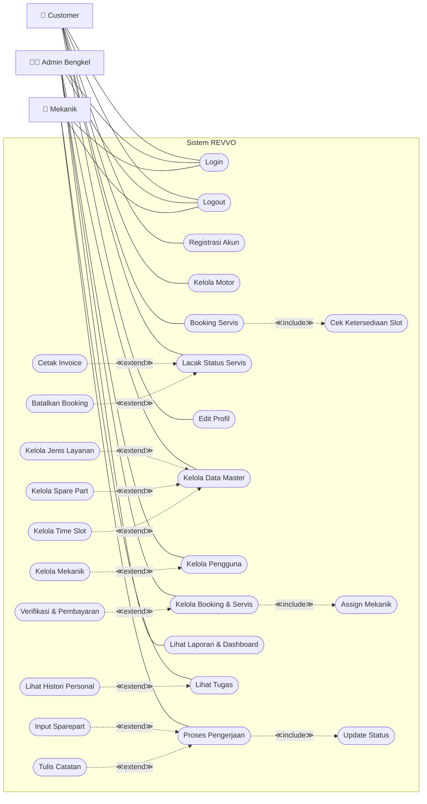

# Use Case Diagram — Sistem REVVO

## Ringkasan

- **3 Aktor**: Customer, Admin Bengkel, Mekanik
- **13 Use Case utama** + 13 sub (3 include + 10 extend)
- Dari 26 bubble → dikelompokkan ke master data + include/extend

## Diagram

## Daftar Use Case

| ID | Use Case | Aktor | Tipe |
|----|----------|-------|------|
| UC1 | Login | Semua | Utama |
| UC2 | Logout | Semua | Utama |
| UC3 | Registrasi Akun | Customer | Utama |
| UC4 | Kelola Motor | Customer | Utama (CRUD) |
| UC5 | Booking Servis | Customer | Utama |
| UC5a | Cek Ketersediaan Slot | Sistem | Include dari UC5 |
| UC6 | Lacak Status Servis | Customer | Utama |
| UC6a | Cetak Invoice | Customer | Extend dari UC6 |
| UC6b | Batalkan Booking | Customer | Extend dari UC6 |
| UC7 | Kelola Data Master | Admin | Utama |
| UC7a | Kelola Jenis Layanan | Admin | Extend dari UC7 |
| UC7b | Kelola Spare Part | Admin | Extend dari UC7 |
| UC7c | Kelola Time Slot | Admin | Extend dari UC7 |
| UC8 | Kelola Pengguna | Admin | Utama |
| UC8a | Kelola Mekanik | Admin | Extend dari UC8 |
| UC9 | Kelola Booking & Servis | Admin | Utama |
| UC9a | Assign Mekanik | Admin | Include dari UC9 |
| UC9b | Verifikasi & Pembayaran | Admin | Extend dari UC9 |
| UC10 | Lihat Laporan & Dashboard | Admin | Utama |
| UC11 | Lihat Tugas | Mekanik | Utama |
| UC11a | Lihat Histori Personal | Mekanik | Extend dari UC11 |
| UC12 | Proses Pengerjaan | Mekanik | Utama |
| UC12a | Update Status | Mekanik | Include dari UC12 |
| UC12b | Input Sparepart | Mekanik | Extend dari UC12 |
| UC12c | Tulis Catatan | Mekanik | Extend dari UC12 |
| UC13 | Edit Profil | Customer | Utama |

## Catatan Revisi

- **Sebelum**: 26 bubble flat tanpa relasi include/extend
- **Revisi 1**: 12 bubble utama → dikelompokkan master data + include/extend
- Admin CRUD master data dikelompokkan ke **Kelola Data Master** dengan extend per entitas
- Kelola Mekanik menjadi extend dari **Kelola Pengguna**
- Proses Pengerjaan mekanik dipecah: update status (include/wajib), input sparepart & catatan (extend/opsional)
- **Revisi 2**: Tambah Edit Profil (UC13), Batalkan Booking (UC6b extend), Histori Personal Mekanik (UC11a extend), Activity Logout (UC2)
